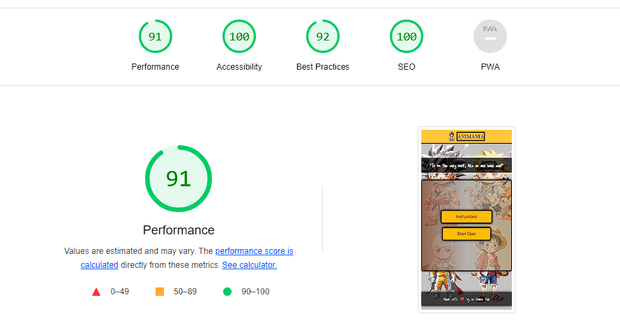

# Welcome to Animania! 🌟

> Original inspiration for this project comes from a deep-rooted passion for anime and the vibrant anime community. Created as a unique and engaging way to dive into the world of anime through an interactive quiz.

View [live site here](https://makiaveli1.github.io/Animania/)

## Table of Contents

1. [Description](#description)
2. [UX Design](#ux-design)
3. [Features](#features)
4. [Game Mechanics](#game-mechanics)
5. [Technologies Used](#technologies-used)
6. [Testing](#testing)
7. [Code Structure](#code-structure)
8. [Deployment](#deployment)
9. [Setup Instructions](#setup-instructions)
10. [Contributing](#contributing)
11. [Future Plans](#future-plans)
12. [Credits](#credits)

## Description

Welcome to Animania, the ultimate anime quiz game! In this game, players are presented with multiple-choice questions about various anime series. The aim is to answer correctly to score points and climb up the leaderboard.

### Project Background

The project was inspired by a love for anime and the desire to create an interactive platform where anime enthusiasts can test their knowledge. It aims to provide a fun, engaging experience while educating players on different aspects of anime.

## UX Design

### Goals

- Create a fun and interactive quiz game centered around anime.
- Provide an easy-to-navigate and visually appealing user interface.

### Design Choices

The design is inspired by vibrant anime aesthetics, with the use of lively colors and dynamic fonts. The layout is clean and straightforward, aiming to provide an immersive user experience without overwhelming the player.

#### Typography

- **Main Font**: 'Just Me Again Down Here' from Google Fonts, used for its playful and engaging appearance.
- **Secondary Font**: 'Source Serif Pro' & 'Pangolin', used for their readability and modern appeal.

### Color Scheme

The project employs a carefully selected color scheme to enhance user engagement and aesthetic appeal. Below is the breakdown:

#### Background Colors

- Light Gray: `#c4c4c4`
- Yellow: `#ffbb00`
- Dark Yellow: `#fec833`
- Black with opacity: `rgba(0, 0, 0, 0.7)`
- Gradient: `linear-gradient(to right, rgba(135, 79, 54, 0.81), rgba(179, 173, 166, 0.81), rgba(176, 138, 77, 0.56))`

#### Text Colors

- White: `#fff` and `#fcfcfc`
- Black: `#000`
- Dark Gray: `rgb(19, 18, 18)`

#### Special Cases

- Correct Answers: `green`
- Wrong Answers: `red`

#### Imagery

Images were generated through Leonardo.ai and then vectorized using Vectorizer.ai for efficient and clean rendering. The SVG format ensures scalability without loss of quality.

### Wireframes

Wireframes serve as the blueprint for the design and layout of the application. They offer a visual guide that represents the skeletal framework of the application. Below are the wireframes for different parts of the Animania project:

#### Mobile Look

#### Tablet Look

#### Desktop Look

These wireframes were designed to provide a seamless user experience while maintaining a clean and attractive interface.

## Features

- **Index Page**: The landing page offers an introduction to the game and a 'Start Quiz' button.
- **Quiz Page**: Players are directed here to take the quiz, which consists of multiple-choice questions.

## Game Mechanics

The game incorporates a timer for each question, pushing players to think on their feet. Each correct answer earns the player points, which are tallied at the end to determine the final score.

## Technologies Used

- HTML: For structuring the content.
- CSS: For styling the interface.
- JavaScript: For implementing interactive features.

### Technical Choices

The project uses pure HTML, CSS, and JavaScript with no additional libraries. Google Fonts were used for typography, and images were generated and converted using Leonardo.ai and Vectorizer.ai, respectively. All code has undergone extensive testing, including Lighthouse, HTML, CSS, and JS validation.

## Testing

Testing is a crucial aspect of the development process. For Animania, we employed a variety of tests to ensure the game's reliability and efficiency.

### Code Validation

#### HTML Validation

The HTML code was verified using the W3C Markup Validator. The test confirmed that all pages are compliant with current HTML5 standards. This helps in ensuring that the website functions consistently across different web browsers.

#### CSS Validation

The CSS code was validated through the W3C CSS Validator. The code passed the test, which means it is well-structured and free of any syntax errors.

#### JavaScript Validation

For JavaScript, the JSHint tool was used. This tool is excellent for detecting errors and potential problems in JavaScript code. No issues were found during the validation process, ensuring that the game logic is robust and efficient.

### Performance Testing

#### Lighthouse Testing

Performance testing was done using Google Lighthouse. This tool provides valuable insights into various performance metrics such as load time, accessibility, and SEO. Animania scored high in all these areas, indicating that the website is well-optimized.

## Testing

Code validation was performed using various online tools, and the results can be found in the `assets/images/validation-images/` folder. Lighthouse testing was also performed to ensure optimal performance and accessibility.

## Code Structure

The code is organized into separate folders for HTML, CSS, and JavaScript files, making it easier to navigate. Each file serves a specific purpose:

- **HTML Files**: Handle the layout and structure.
  - `index.html`: The main landing page.
  - `quiz.html`: The quiz interface.
- **CSS Files**: Manage the styling.
  - `style.css`: General styles that apply to the entire project.
  - `quiz_style.css`: Styles specific to the quiz.
- **JavaScript Files**: Implement the game logic.
  - `questions.js`: Stores the quiz questions.
  - `quiz.js`: Manages the quiz gameplay.
  - `script.js`: Handles general JavaScript functionalities.

## Deployment

Animania is currently hosted on GitHub Pages, a static site hosting service. The site is automatically updated with each commit to the GitHub repository. [here](https://makiaveli1.github.io/Animania/).

## Credits

Special thanks to various anime series and online communities for inspiring the quiz questions. Additional acknowledgments to Leonardo.ai and Vectorizer.ai for image generation and conversion.

### Code Modularity

The code follows the principle of modularity, making it easier to debug, update, and understand. Each function is designed to perform a specific task and is documented for clarity.

### Domain Setup

Though the project currently uses the default domain provided by GitHub Pages, there are plans to acquire a custom domain to make the URL more memorable and relevant to the content.

### Setup Instructions

#### Prerequisites

To run Animania locally, you'll need the following:

- A web browser (e.g., Google Chrome, Firefox, Safari)
- An IDE (e.g., Visual Studio Code, Sublime Text, Atom)
- Git installed on your computer

#### Installation

1. Fork the GitHub repository to your account.
2. Clone your forked repository onto your computer using `git clone`.
3. Navigate to the project directory in your terminal.
4. Open the `index.html` file with your web browser.

### Contributing

#### Contribution Guidelines

If you're interested in contributing, we'd love your help! Before you start, please take a look at our contribution guidelines, which are designed to make the process smooth for everyone.

1. Fork the GitHub repository to your personal account.
2. Clone your fork to your local machine using `git clone`.
3. Create a new branch for your feature or fix (`git checkout -b new-feature`).
4. Make your changes and test them.
5. Commit your changes (`git commit -m 'Add new feature'`).
6. Push the changes to your fork (`git push origin new-feature`).
7. Create a pull request against the `main` branch of the original repository.

#### Feature Requests and Bug Reports

If you have any feature requests or find any bugs, please feel free to open an issue in the GitHub repository. We appreciate community feedback and will do our best to address your concerns.

### Future Plans

#### Short-term Goals

In the short term, we plan to add more categories and questions to the quiz. This will make the game more engaging and educational.

#### Long-term Goals

Long-term plans include adding sound effects and background music to enhance the user experience. We are also considering developing a mobile application for Animania, allowing users to play on the go.

### Credits

#### Content and Inspiration

The quiz questions were carefully curated to cover a wide range of topics in anime. The inspiration came from various anime series, movies, and online forums.

#### Special Thanks

A special thanks to Leonardo.ai for generating images used in the project and Vectorizer.io for converting the images to SVG format. These tools have significantly contributed to the visual appeal of Animania.

### Accessibility

In line with best practices, efforts have been made to make Animania accessible to all users, including those with disabilities. Semantic HTML5 elements have been used to improve screen reader compatibility.

### Performance and Optimization

The website has been optimized for speed and performance. Lazy loading is implemented for images, and all scripts are minified. This ensures a smooth and fast user experience.

### Security Features

Although the primary focus of Animania is to provide a fun quiz experience, security has not been overlooked. Data validation is performed on both the client and server sides to prevent malicious activities.

### User Engagement

To keep players engaged, the future roadmap includes the introduction of badges and achievements. These will be awarded based on various criteria such as high scores, consecutive days of playing, etc.

### Community

Animania aims to build a community around itself. Plans are underway to integrate a forum where players can discuss anime series, share tips on the game, and even suggest new features.

### Conclusion

Animania is more than just a quiz; it's a celebration of anime culture. It aims to bring together anime enthusiasts from around the world and provide them with an engaging, educational, and entertaining platform.

Thank you for your interest in Animania! We hope you enjoy the quiz as much as we enjoyed creating it.
